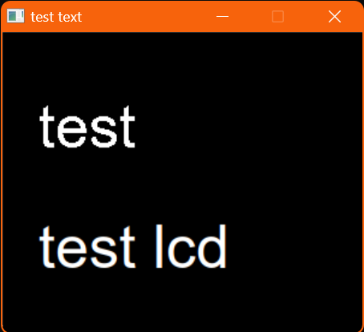
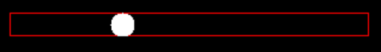

# SDL Extras

SDL Extras is a simple extension library for SDL made in C++.

## File Organisation
this repository follow a file organisation wich is the most used with SDL:
- a bin dir : with .o, .dll and .exe
- a lib dir: with .a files sdl
- a include dir: with all the headers (.h)
- a src dir with your source code (.c or .cpp).

here the src dir contains the sdl_extras source code but you can put this code in a specific dir

## include and code

### include

to include this librairy you just have to include the header SDL_Extras.hpp
> [!WARNING]
> don't forgot to compile the sdl_extras librairy, you can compile oly once the librairy and use the .o files

you can use a make file: [here](makefile)
you can also use line command : [here](compiler_syntax.txt)

### code
you can just use the function and the methods
> [!IMPORTANT]
> all the calls and functions of SDL_Extras are in a namespace named: `SDL_E`
> you can acess all the function and class with the syntax : `SDL_E::class_name` or `SDL_E::function_name`

## Documentation

table of contents:
- [Vector](#vector)
- [Text](#text)
- [Text Zone](#text-zone)
- [Button](#button)
- [Scroll Bar](#scroll-bar)
- [Shapes](#shapes)
- [collisions](#collisions)
- [drawings](#drawings)

### Vector
Vector is a simple class representing a mathematic vector defined with two coordinates x and y (with int coordinates)

a lot of operators are overloading:
- `+`
- `+=` (only with int)
- `-`
- `-=`
- `*` (only with int)
- `*=` (only with int)
- `==`
- `!=`
- and `<<` that out : "x:`x value`, y:`y value`"

> [!NOTE]
> there is also a function named move() that take can take class like buttons, text, etc... an move these by a vector

### Text
a Text class that use the SDL_TTF package to render text : [see here](https://github.com/libsdl-org/SDL_ttf)

important methods:
- constructor, init this class with a message (a string), a font (a TTF_Font* struct createed with sdl_ttf package) and a rendering context
- `set_color()` a method to set the color of your text (default is white)
- `Draw()` draw your text in the rendering context
- a lot of other methods to change the position, the message, the font, ...

SDL TTF allow diferents way to draw text, Text class used 2 of these rendering function, Solid text rendering and LCD text rendering
by default Text class use SOlid way but LCD render text with a best resolution
> [!WARNING]
> the LCD rendering use a backgroud text color so you have to define it, it can be transparent

> [!NOTE]
> you can change the rendering mode with the method `add_flags()` and the flags: `TEXT_SOLID` or `TEXT_LCD`

example of implementation:
```cpp
TTF_Font* arial = TTF_OpenFont("arial.ttf", 20); // opening a font with SDL_ttf package
SDL_E::Text text{arial, renderer, "test", 30, 30}; // create a text with arial font, with "test" message with (30,30) coordinates
SDL_E::Text text_lcd{arial, renderer, "test lcd", 100, 100};
text_lcd.add_flag(TEXT_LCD); // set the flag to lcd

// setting the lcd bazckgroud to transparent:
SDL_Color transparent = {0,0,0,0};
SDL_SetRenderDrawBlendMode(renderer,SDL_BLENDMODE_BLEND); // to not forgot this line
text_lcd.set_bg_color(transparent);

text.Draw();
text_lcd.Draw();
SDL_RenderPresent(renderer);
```
the result:


on top: solid rendering
on bottom: LCD rendering

## Text Zone
a class that inherit from Text class that is define with a rectangle: the zone that the user can fill with text
important methods:
- `Draw()` render the text (not render the zone rectangle)
- `add_typed_chars()` a methos you should put in your envent gestionnary and whan the user type whars, there will be added in the text zone

> [!CAUTION]
> the typed text is add to the end of the precedent text and there is no cursor to move and modify text somwhere else than the end.

> [!NOTE]
> non ascii chars are not added to the text zone 

### Button
a button class formed with a text and a rectangle.
there is also a padding values (wich is the space between text and rectangle)

the button is like a Text class with padding and rectangle attributes.

there are also methods ta manipulate a std::vector of button:
- `buttons_clicked()` put this function in your event gestionnary to know is buttons are clicked (the method `clicked()` can be call after to know if a button is clicked)
- `draw_buttons()` draw all the buttons in the vector

> [!NOTE]
> these functions works also with a c like array (Buttons[])


### Scroll Bar

a scroll bar is a class (like this (v))


there is two mods of scroll bars:

- first the scroll int mode (associated with the flag: `SCROLL_INT_MODE`)
with this mode the scroll bar is defined with:
    - a start value 
    - a step value (the size of the step between values)
    - a value wich is the nuber of values separated by steps

- the scroll float mode (associated with the flag: `SCROLL_FLOAT_MODE`)
with this mode the scroll bar is defined with:
    - a start value 
    - a end value

you can change mode with the method: `change_mode()`

there also 2 importants methods witch are:
    - `Draw()` : draw the scroll bar
    - `Update()` : update the state of the scroll bar, put this method in your event gestionnary

> [!NOTE]
> with int mode when you click in the scroll bar it is set to the nearest value

### Shapes

in SDL_Extras, shapes(only polygons) can be defined with 2 structures:
    - a struct named shape that contains a c like arry of point and the nuber of points
    - a std::vector of points

> [!NOTE]
> Points are defined with SDL_Point struct (or sometimes x and y coordinates)
> rectangles are difined with SDL_Rect struct
> circles are defined with a point and a radius value

### collisions

SDL extras include collision or intersection wich are between:
- a poit and a rectangle
- two rectangles
- a point and a circle
- two circles
- a point and a polygon
- two polygons

### drawings

SDL library have a lot of functions to draw shapes like: lines, points, rectangles, ...

SDL_Extras add these drawings:
- circles
- polygons [more](#shapes)

> [!NOTE]
> all these added drawings can be drawn filled or non filled

